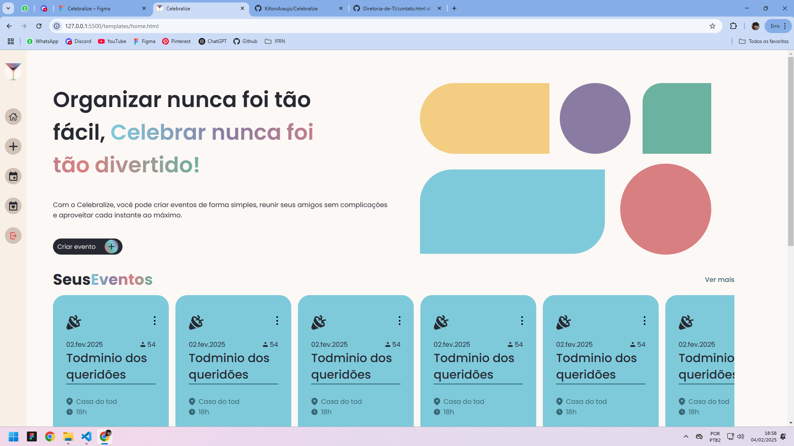

# Celebralize

## DNS http://celebralize.servehttp.com/

O **Celebralize** é um projeto desenvolvido durante a disciplina de **Instalação e Configuração de Servidores** no curso técnico integrado de **Informática para a Internet** no **IFRN-CNAT**.  
Este site tem como objetivo facilitar a criação e o gerenciamento de eventos entre amigos, permitindo a organização prática de encontros e compromissos sociais.

## Sobre o Projeto

Durante a disciplina, exploramos a configuração de servidores web utilizando tecnologias como **Linux**, **Apache2** e **MariaDB (SQL)**.  
O **Celebralize** foi criado como um projeto prático para aplicar os conceitos aprendidos, com destaque para:  
- Configuração de servidores web.  
- Gerenciamento de banco de dados relacional.    

## Interface

---

## Sobre o Curso

O curso de **Informática para a Internet** no **IFRN-CNAT** oferece uma formação voltada para o desenvolvimento de habilidades práticas na criação de soluções digitais utilizando tecnologias da informação. Ao longo do curso, foram abordados diversos conceitos de programação, incluindo estruturas de dados, lógica de programação, e desenvolvimento de sistemas.

---

## Estrutura do Projeto

O **Celebralize** é composto por funcionalidades voltadas à organização de eventos, incluindo:  
- Cadastro de usuários.  
- Criação de eventos com descrição, data e duração.  
- Sistema de confirmação de presença para gerenciar participantes.  

Os dados são armazenados em um banco de dados relacional configurado no MariaDB, enquanto o servidor web é gerenciado pelo Apache2.  

---

## Tecnologias Utilizadas

- **Linux**: Sistema operacional base para a configuração do ambiente.  
- **Apache2**: Servidor web utilizado para hospedar o site.  
- **MariaDB (SQL)**: Banco de dados relacional para armazenar informações de usuários e eventos.  
- **HTML, CSS e JavaScript**: Desenvolvimento do front-end do site.  
- **VS Code**: Editor de código recomendado.  

---

## Estrutura do Repositório

Este repositório contém:  
- **Configurações do servidor**: Scripts e arquivos necessários para configurar o ambiente no Apache2 e MariaDB.  
- **Código do site**: Arquivos de front-end (HTML, CSS, JavaScript) e integração com o back-end.  
- **Script do banco de dados**: SQL para criar e gerenciar as tabelas do projeto.  

---

## Autores

### Kilton Jhonathan de Araújo  
(Use o tema escuro para visualizar meus contatos!)  

  
